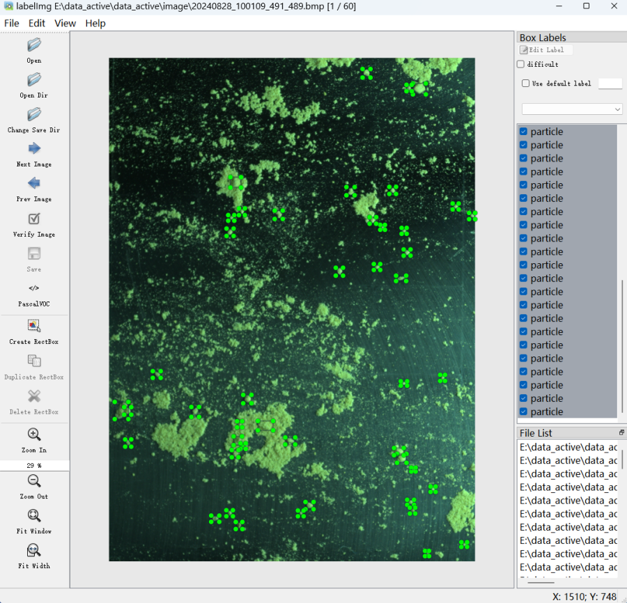

# Chinese-medicine-powder-dataset

本数据集为论文《基于跨子块多核注意力YOLOv8和主动学习的中药颗粒检测》中使用的数据集，包含随机划分方式、拍摄环境说明、标注规范及样例数据，用于提升研究透明度和促进学术研究。

---

## 一、数据集划分方式

本数据集包含 582 张中药颗粒图像。  
颗粒区域经人工标注后，按照以下方式进行随机划分：

- **训练集：** 约 80%（465 张）  
- **测试集：** 约 20%（117 张）  

> 若研究需要，也可采用 **7:2:1比例** 进行划分，以适应不同模型训练需求。

---

## 二、拍摄环境说明

图像采集采用大华工业相机（型号：A3A20CU24，分辨率 4000×3000，1200 万像素），在实际生产场景下完成。  
为增强模型的鲁棒性与泛化能力，拍摄环境划分为以下四种典型场景：

1. **绿色颗粒 — 明亮环境（平面背景）**  
2. **黄色颗粒 — 明亮环境（平面背景）**  
3. **黄色颗粒 — 暗环境（平面背景）**  
4. **黄色颗粒 — 明亮环境（圆盘背景）**

### 环境样例展示
（以下图片仅为示意，可替换为真实图片路径）

| 序号 | 拍摄环境 | 示例图片 |
|------|-----------|-----------|
| 1 | 绿色颗粒明亮环境（平面背景） |  |
| 2 | 黄色颗粒明亮环境（平面背景） |  |
| 3 | 黄色颗粒暗环境（平面背景） |  |
| 4 | 黄色颗粒明亮环境（圆盘背景） |  |

---

## 三、标注规范说明

中药颗粒目标检测的标注采用 **labelimg** 工具完成，标注类别统一为：

- **particle**（颗粒）

### 标注示例展示
| 示例 | 说明 |
|------|------|
| 标注界面截图 |  |

---

## 四、样例图片展示

部分经标注的图像样例如下所示：

| 序号 | 图像示例 |
|------|-----------|
| 1 |  |
| 2 |  |
| 3 |  |

---

## 五、数据集获取方式

为便于学术研究与模型复现，现公开部分样例数据供参考。  
完整数据将在论文录用后开源。

🔗 **百度网盘下载链接：** [https://pan.baidu.com/s/xxxxxxxxxx](https://pan.baidu.com/s/xxxxxxxxxx)  
🔑 **提取码：** `xxxx`

> 数据仅供科研和教学用途，禁止商用。

---
